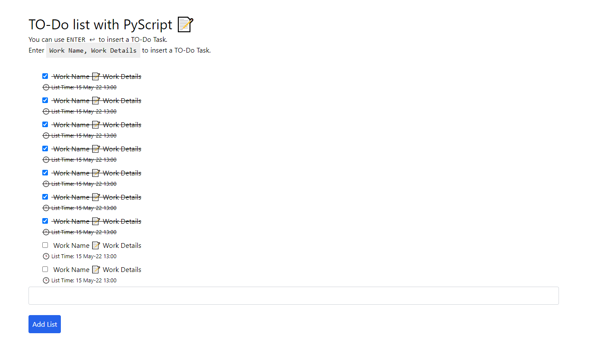

# PyScript TODO

PyScript Based Simple To Do App 

[Visit Web APP](https://naemazam.github.io/PyScript-TODO/)

## Screenshots

## 🔗 Youtube Video Links

## PyListTemplate and PyItemTemplate

[Read documentation](https://github.com/pyscript/pyscript/blob/fadb4a67e7236dfa33cdc1ba778c5d1c3527f1e1/pyscriptjs/src/pyscript.py)

## License

[MIT](https://choosealicense.com/licenses/mit/)

